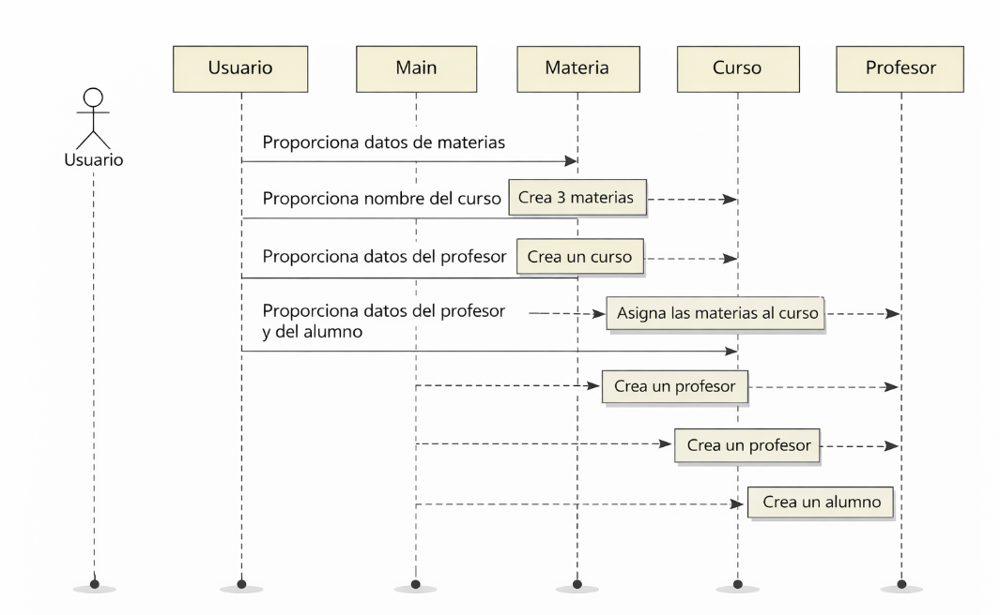
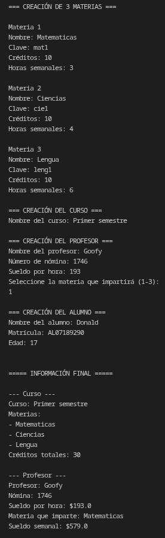

# ACTIVIDAD 4 POO
---
## INTRODUCCIÓN
Aplicar los conocimientos adquiridos sobre relaciones avanzadas entre clases, creando un programa que incluya algunas relacionadas entre sí mediante composición y herencia. Nos basaremos en una problematica sobre una escuela, en donde buscamos mantener un orden y hacer que el programa corra cumpla con los requerimientos


### CÓDIGO

``` java
public class profesor {

    private String nombre;
    private String numeroNomina;
    private double sueldoPorHora;
    private materia materia;

    // Constructor por defecto
    public profesor() {
        this.nombre = "";
        this.numeroNomina = "";
        this.sueldoPorHora = 0;
        this.materia = null;
    }

    // Constructor con parámetros
    public profesor(String nombre, String numeroNomina, double sueldoPorHora, materia materia) {
        this.nombre = nombre;
        this.numeroNomina = numeroNomina;
        this.sueldoPorHora = sueldoPorHora;
        this.materia = materia;
    }

    // Getters
    public String getNombre() {
        return nombre;
    }

    public String getNumeroNomina() {
        return numeroNomina;
    }

    public double getSueldoPorHora() {
        return sueldoPorHora;
    }

    public materia getMateria() {
        return materia;
    }

    // Setters (menos materia)
    public void setNombre(String nombre) {
        this.nombre = nombre;
    }

    public void setNumeroNomina(String numeroNomina) {
        this.numeroNomina = numeroNomina;
    }

    public void setSueldoPorHora(double sueldoPorHora) {
        this.sueldoPorHora = sueldoPorHora;
    }

    // Método para calcular sueldo semanal
    public double calcularSueldoSemanal() {
        if (materia != null) {
            return sueldoPorHora * materia.getHorasSemanales();
        }
        return 0;
    }

    public String toString() {
        String info = "Profesor: " + nombre +
                      "\nNómina: " + numeroNomina +
                      "\nSueldo por hora: $" + sueldoPorHora;

        if (materia != null) {
            info += "\nMateria que imparte: " + materia.getNombre();
            info += "\nSueldo semanal: $" + calcularSueldoSemanal();
        } else {
            info += "\nNo tiene materia asignada.";
        }

        return info;
    }
}
```

``` java
public class materia {
    
    private String nombre;
    private String clave;
    private int creditos;
    private int horasSemanales;

    public materia(){
        this.nombre = "";
        this.clave = "";
        this.creditos = 0;
        this.horasSemanales = 0;
    }

    public materia(String nombre, String clave, int creditos, int horasSemanales){
        this.nombre = nombre;
        this.clave = clave;
        this.creditos = creditos;
        this.horasSemanales = horasSemanales;
    }

    public materia(materia otra){
        this.nombre = otra.nombre;
        this.clave = otra.clave;
        this.creditos = otra.creditos;
        this.horasSemanales = otra.horasSemanales;
    }

    public String getNombre(){
        return nombre;
    }

    public void setNombre(String nombre){
        this.nombre = nombre;
    }
    
    public String getClave(){
        return clave;
    }

    public void setClave(String clave){
        this.clave = clave;
    }

    public int getCreditos(){
        return creditos;
    }

    public void setCreditos(int creditos){
        this.creditos = creditos;
    }

    public int getHorasSemanales(){
        return horasSemanales;
    }

    public void setHorasSemanales(int horasSemanales){
        this.horasSemanales = horasSemanales;
    }

    public String toString(){
        return "Materia: " + nombre + "\nClave: " + clave + "\nCréditos: " + creditos + "\nHoras semanales: " + horasSemanales;
    }
}
```
``` java
import java.util.ArrayList;

public class curso {

    private String nombre;
    private ArrayList<materia> materias;

    // Constructor por defecto
    public curso() {
        this.nombre = "";
        this.materias = new ArrayList<>();
    }

    // Constructor con parámetro
    public curso(String nombre) {
        this.nombre = nombre;
        this.materias = new ArrayList<>();
    }

    // Getter y Setter del nombre
    public String getNombre() {
        return nombre;
    }

    public void setNombre(String nombre) {
        this.nombre = nombre;
    }

    // Método para agregar materias (máximo 3)
    public void agregarMateria(materia materia) {
        if (materias.size() < 3) {
            materias.add(materia);
        } else {
            System.out.println("No se pueden agregar más de 3 materias.");
        }
    }

    // Método para calcular créditos totales del curso
    public int calcularCreditosTotales() {
        int total = 0;

        for (materia m : materias) {
            total += m.getCreditos();
        }

        return total;
    }

    // Getter del ArrayList (por si lo necesitamos después)
    public ArrayList<materia> getMaterias() {
        return materias;
    }

    @Override
    public String toString() {
        String info = "Curso: " + nombre + "\n";
        info += "Materias:\n";

        for (materia m : materias) {
            info += "- " + m.getNombre() + "\n";
        }

        info += "Créditos totales: " + calcularCreditosTotales();

        return info;
    }
}

```

```java
public class alumno {

    private String matricula;
    private String nombre;
    private int edad;
    private curso curso;

    // Constructor por defecto
    public alumno() {
        this.matricula = "";
        this.nombre = "";
        this.edad = 0;
        this.curso = null;
    }

    // Constructor con parámetros
    public alumno(String matricula, String nombre, int edad, curso curso) {
        this.matricula = matricula;
        this.nombre = nombre;
        this.edad = edad;
        this.curso = curso;
    }

    // Getters
    public String getMatricula() {
        return matricula;
    }

    public String getNombre() {
        return nombre;
    }

    public int getEdad() {
        return edad;
    }

    public curso getCurso() {
        return curso;
    }

    // Setters (permitimos cambiar datos básicos)
    public void setMatricula(String matricula) {
        this.matricula = matricula;
    }

    public void setNombre(String nombre) {
        this.nombre = nombre;
    }

    public void setEdad(int edad) {
        this.edad = edad;
    }

    public void setCurso(curso curso) {
        this.curso = curso;
    }

    public String toString() {
        String info = "Alumno: " + nombre +
                      "\nMatrícula: " + matricula +
                      "\nEdad: " + edad;

        if (curso != null) {
            info += "\nCurso inscrito: " + curso.getNombre();
        } else {
            info += "\nNo está inscrito en ningún curso.";
        }

        return info;
    }
}

```

``` java
import java.util.Scanner;

public class act_4 {

    public static void main(String[] args) {

        Scanner sc = new Scanner(System.in);

        // ===== CREAR MATERIAS =====
        System.out.println("=== CREACIÓN DE 3 MATERIAS ===");

        materia[] materias = new materia[3];

        for (int i = 0; i < 3; i++) {
            System.out.println("\nMateria " + (i + 1));

            System.out.print("Nombre: ");
            String nombre = sc.nextLine();

            System.out.print("Clave: ");
            String clave = sc.nextLine();

            System.out.print("Créditos: ");
            int creditos = sc.nextInt();

            System.out.print("Horas semanales: ");
            int horas = sc.nextInt();
            sc.nextLine(); // limpiar buffer

            materias[i] = new materia(nombre, clave, creditos, horas);
        }

        // ===== CREAR CURSO =====
        System.out.println("\n=== CREACIÓN DEL CURSO ===");

        System.out.print("Nombre del curso: ");
        String nombreCurso = sc.nextLine();

        curso curso = new curso(nombreCurso);

        for (int i = 0; i < 3; i++) {
            curso.agregarMateria(materias[i]);
        }

        // ===== CREAR PROFESOR =====
        System.out.println("\n=== CREACIÓN DEL PROFESOR ===");

        System.out.print("Nombre del profesor: ");
        String nombreProfesor = sc.nextLine();

        System.out.print("Número de nómina: ");
        String nomina = sc.nextLine();

        System.out.print("Sueldo por hora: ");
        double sueldoHora = sc.nextDouble();

        System.out.println("Seleccione la materia que impartirá (1-3): ");
        int opcionMateria = sc.nextInt();
        sc.nextLine(); // limpiar buffer

        profesor profesor = new profesor(
                nombreProfesor,
                nomina,
                sueldoHora,
                materias[opcionMateria - 1]
        );

        // ===== CREAR ALUMNO =====
        System.out.println("\n=== CREACIÓN DEL ALUMNO ===");

        System.out.print("Nombre del alumno: ");
        String nombreAlumno = sc.nextLine();

        System.out.print("Matrícula: ");
        String matricula = sc.nextLine();

        System.out.print("Edad: ");
        int edad = sc.nextInt();

        alumno alumno = new alumno(matricula, nombreAlumno, edad, curso);

        // ===== MOSTRAR RESULTADOS =====
        System.out.println("\n\n===== INFORMACIÓN FINAL =====");

        System.out.println("\n--- Curso ---");
        System.out.println(curso);

        System.out.println("\n--- Profesor ---");
        System.out.println(profesor);

        System.out.println("\n--- Alumno ---");
        System.out.println(alumno);

        sc.close();
    }
}

```

### DIAGRAMA 


## SALIDA ESPERADA



